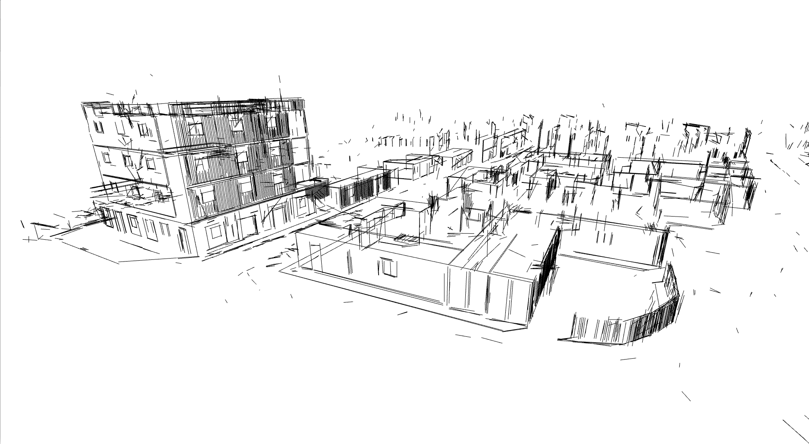
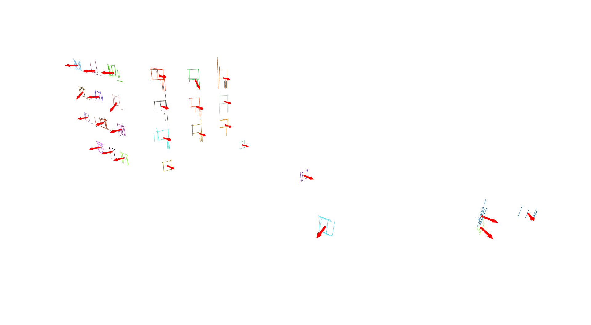

# widnow-tracker

<p align='center'>
    
    
</p>

## Description

This is the window global normal computation code. The code present in this repository performs the following tasks:  
1- Build a 3D line sketch using all image frames, poses and 3D points from either COLMAP or ORBSLAM3.  
2- Detect windows using DETR.   
3- Track windows in image frames using a combination of 2D line tracks, 2D bounding box detections and heuristics.    
4- Using all accommulated line tracks per window object, it computes the normal direction and window centroid.  

Main dependencies include:   
1- COLMAP (https://github.com/colmap/colmap).  
2- PoseLib (https://github.com/PoseLib/PoseLib).  
3- DETR (https://gitlab.com/missionsystems/hyperteaming/detr).  
Depending on whether COLMAP or ORBSLAM3 is used, some of these dependencies can be ignored.   


## Installation

**Install the dependencies as follows:**
* CMake >= 3.17
* COLMAP 3.8 [[the official guide](https://colmap.github.io/install.html)] _make sure to use the tag 3.8_
* PoseLib [[Guide](misc/install/poselib.md)]
* HDF5
* pytorch
* torchvision
```bash
sudo apt-get install libhdf5-dev
```
* Python 3.9 + required packages
```bash
git clone https://gitlab.com/missionsystems/hyperteaming/window-tracker
cd window-tracker
git submodule update --init --recursive

# fix broken dependency
cd limap
export BASE=$PWD
cd third-party/TP-LSD
git checkout 5558050
cd tp_lsd/modeling
rm -r DCNv2
git clone https://github.com/lucasjinreal/DCNv2_latest.git DCNv2
cd $BASE

# install line-mapping
python -m pip install -r requirements.txt
python -m pip install -Ive .
python -c "import limap"
```
***

## Getting Started

Windows tracking and normal estimation based on COLMAP:
```
./run_demo_colmap.sh
```
Windows tracking and normal estimation based on ORB_SLAM3:
```
./run_demo_mono_slam.sh
```
